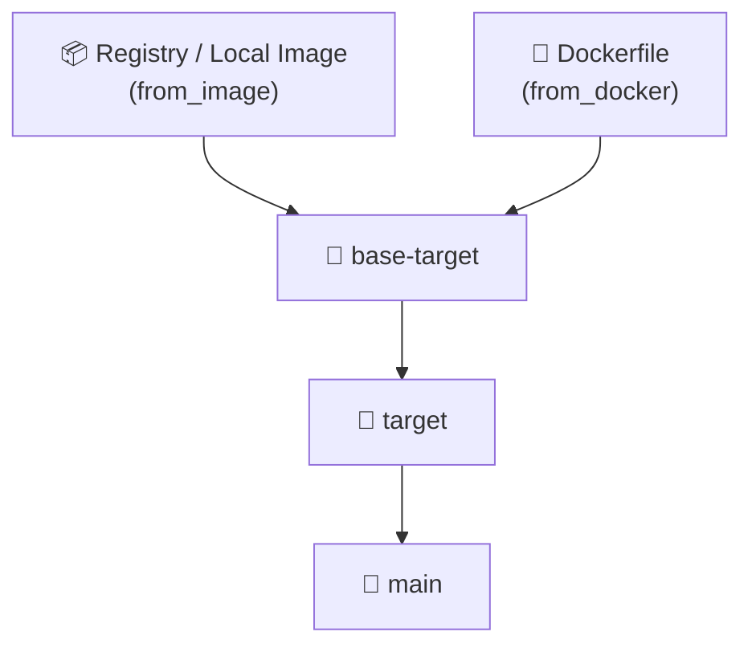
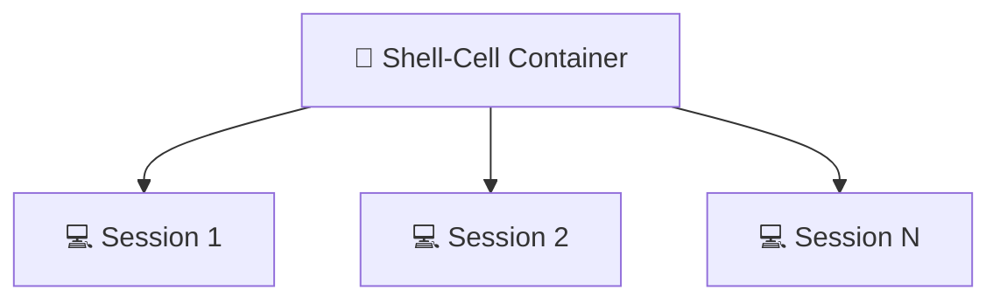

## 💡 The Core Idea

**Shell-Cell** is a lightweight containerized shells orchestrator
that turns simple [CUE](https://cuelang.org) blueprints into instant, isolated shell sessions.

It could be really handy, when you want to have secure, isolated place for your development.

## 🏛️ Architecture concepts

1. **The Blueprint (`scell.cue`)**. 
    Everything starts with the configuration file.
    It describes how your environment should be built, how it should behave at runtime and what data or resources you are exposing to it.

2. **Shell-Cell targets.** 
    Think of *targets* as named functions — instead of one giant, monolithic `Dockerfile`,
    **Shell-Cell** encourages you to break your setup into logical pieces.
    Targets are chained together via `from`, forming a linear graph resolved from your entry point down to the root.
    At the root level, the chain must terminate with either a registry/locally-built image (`from_image`) or a Dockerfile (`from_docker`):

```mermaid
graph TD
    R1["📦 Registry / Local Image\n(from_image)"]
    R2["📄 Dockerfile\n(from_docker)"]
    T2["🔧 base-target"]
    T1["🔧 target"]
    M["🔧 main"]

    R1 & R2 --> T2 --> T1 --> M
```

1. **"Shell Server" Model.** 
    Unlike a standard container that runs a single task and exits, a **Shell-Cell** is designed to hang.
    By using the `hang` instruction, the container stays alive in the background, acting as a persistent server.
    This allows you to attach multiple **Shell-Cell** sessions to a warm, ready-to-use environment instantly and preserving the container's state across different sessions.

```mermaid
graph TD
    C["🐳 Shell-Cell Container"]
    C --> S1["💻 Session 1"]
    C --> S2["💻 Session 2"]
    C --> S3["💻 Session N"]
```