## 💡 The Core Idea

**Shell-Cell** is a lightweight containerized shells orchestrator
that turns simple [YAML](https://yaml.org) blueprints into instant, isolated shell sessions.

It could be really handy, when you want to have secure, isolated place for your development.

## 🏛️ Architecture concepts

1. **The Blueprint (`scell.yml`)**. 
    Everything starts with the configuration file. It defines your **Shell-Cell** targets (the environment layers).

2. **Shell-Cell targets.** 
    Think of *targets* as named function, instead of one giant, monolithic `Dockerfile`,
    **Shell-Cell** encourages you to break your setup into logical pieces.

3. **"Shell Server" Model.** 
    Unlike a standard container that runs a single task and exits, a **Shell-Cell** is designed to hang.
    By using the `hang` instruction, the container stays alive in the background, acting as a persistent server.
    This allows you to attach multiple **Shell-Cell** sessions to a warm, ready-to-use environment instantly and preserving the container's state across different sessions.

```mermaid
graph TD
    C["🐳 Shell-Cell Container"]
    C --> S1["💻 Session 1"]
    C --> S2["💻 Session 2"]
    C --> S3["💻 Session N"]
```

